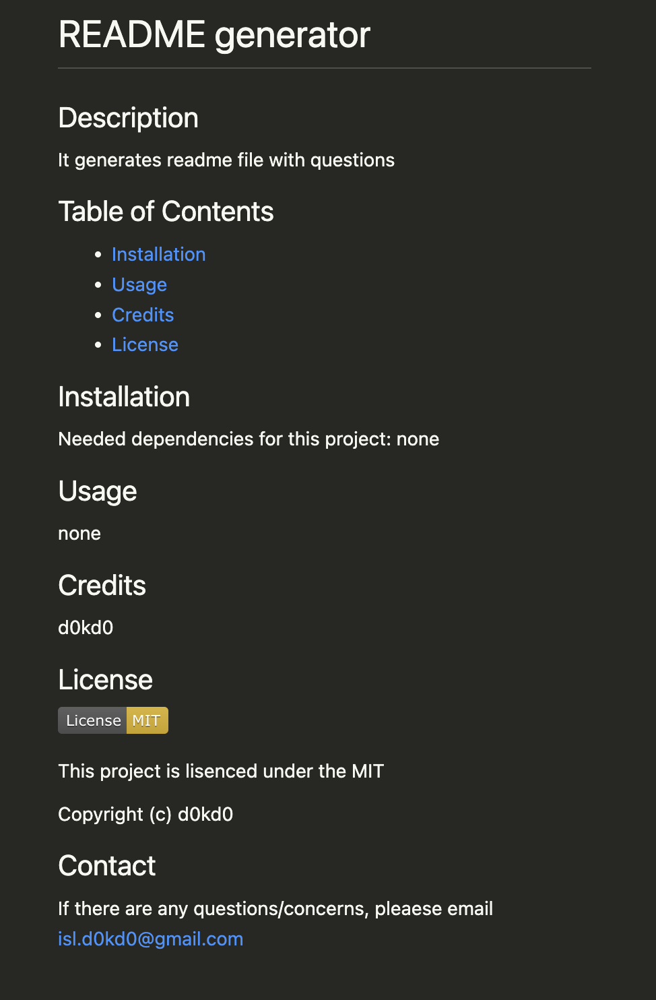

# Professional README Generator Starter Code

## Description
This project is to create a README.md file by using node. Users will be asked for several questions when they run "node index.js" and have auto-generated README.md file after answering all questions.

## Video Walkthrough

## Sample file location
* Location: Develop/assets/README.md
* Screenshot of sample README.md

## Lesson learned
During working on this assignment, I learned following things:
* how to open index.js by using node
* how to use FS(file system) and inquirer
* how to appendFile

## Reference
[How to create a Professional README](https://coding-boot-camp.github.io/full-stack/github/professional-readme-guide)

